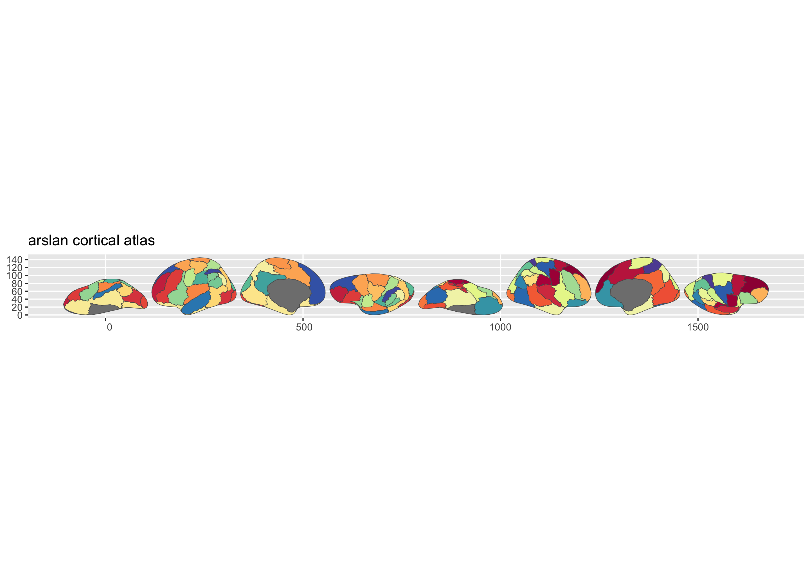

<!-- README.md is generated from README.qmd. Please edit that file -->

# ggsegArslan 

<!-- badges: start -->

[](https://github.com/ggsegverse/ggsegArslan/actions/workflows/R-CMD-check.yaml)
[](https://ggseg.r-universe.dev/ggsegArslan)
<!-- badges: end -->

This package contains dataset for plotting the Arslan atlas with ggseg.

Arslan S & Rueckert D (2015). Multi-level parcellation of the cerebral
cortex using resting-state fMRI. In *International Conference on Medical
Image Computing and Computer-Assisted Intervention* (pp. 47-54).
Springer, Cham.

## Installation

We recommend installing the ggseg-atlases through the ggseg
[r-universe](https://ggseg.r-universe.dev/ui#builds):

``` r
options(repos = c(
  ggseg = "https://ggseg.r-universe.dev",
  CRAN = "https://cloud.r-project.org"
))

install.packages("ggsegArslan")
```

You can install this package from [GitHub](https://github.com/) with:

``` r
# install.packages("pak")
pak::pak("ggsegverse/ggsegArslan")
```

## Arslan atlas

``` r
library(ggseg)
library(ggsegArslan)

plot(arslan())
```



## Data source

Arslan S & Rueckert D (2015). Multi-level parcellation of the cerebral
cortex using resting-state fMRI. In *International Conference on Medical
Image Computing and Computer-Assisted Intervention* (pp. 47-54).
Springer, Cham.
