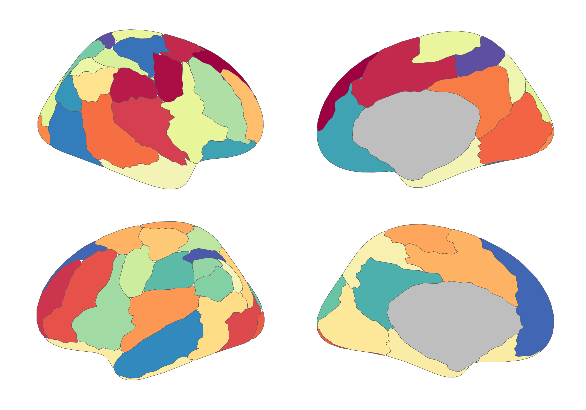

# ggsegArslan

This package contains dataset for plotting the
[Arslan](https://link.springer.com/chapter/10.1007/978-3-319-24574-4_6)
atlas with ggseg and ggseg3d.

Arslan, S., & Rueckert, D. (2015, October). Multi-level parcellation of
the cerebral cortex using resting-state fMRI. In International
Conference on Medical Image Computing and Computer-Assisted Intervention
(pp. 47-54). Springer, Cham.

To learn how to use these atlases, please look at the documentation for
[ggseg](https://ggseg.github.io/ggseg/) and
[ggseg3d](https://ggseg.github.io/ggseg3d).

## Installation

You can install the released version of ggsegArslan from
[GitHub](https://github.com/) with:

``` r
# install.packages("remotes")
remotes::install_github("ggseg/ggsegArslan")
```

## Example

``` r
library(ggsegArslan)
library(ggseg)
library(ggplot2)
```

``` r
ggplot() +
  geom_brain(
    atlas = arslan(),
    mapping = aes(fill = label),
    position = position_brain(hemi ~ view),
    show.legend = FALSE
  ) +
  scale_fill_manual(values = arslan()$palette, na.value = "grey") +
  theme_void()
```



``` r
library(ggseg3d)

ggseg3d(atlas = arslan()) |>
  pan_camera("right lateral")
```


Please note that the ‘ggsegArslan’ project is released with a
[Contributor Code of
Conduct](https://ggseg.github.io/ggsegArslan/CODE_OF_CONDUCT.md). By
contributing to this project, you agree to abide by its terms.
